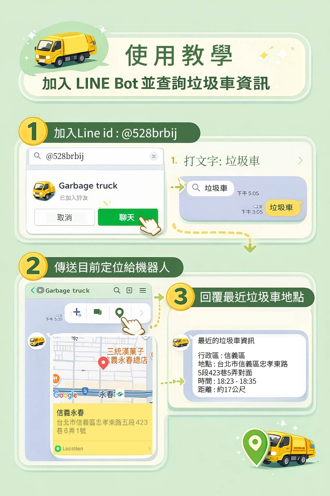

# LINE Bot－台北市垃圾車即時查詢系統

透過 LINE 傳送定位，即可查詢距離最近的台北市垃圾車資訊，並顯示所在行政區。

## 功能特色

- 接收使用者 LINE 定位資訊  
- 計算並回傳距離最近的垃圾車位置  
- 顯示使用者所在地行政區  
- 提供垃圾車抵達與離開時間  
- 顯示與使用者的距離（公尺）  
- 限定台北市範圍內查詢，避免錯誤資料  

## 使用技術

- Node.js  
- LINE Messaging API  
- Axios  
- dotenv  
- Render  
- 台北市政府開放資料 API  
- OpenStreetMap (Nominatim) 反向地理編碼 API

## 公開資料串接說明

串接以下兩項公開資料來源：

1. 台北市政府資料開放平台  
   - 資料集：台北市垃圾車路線與時間  
   - 提供垃圾車地點、經緯度與時間資訊  
   - 資料來源：https://data.taipei/

2. OpenStreetMap (Nominatim) 公開地理資料  
   - 透過反向地理編碼將經緯度轉換為行政區資訊  
   - 資料來源：https://www.openstreetmap.org/

## 雲端部署說明

部署至 Render 雲端平台，作為 LINE Bot Webhook 服務使用。

- 雲端平台：Render  
- 服務類型：Web Service  
- Webhook URL： 

## 使用教學示意圖

  

